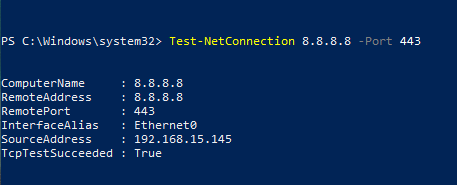
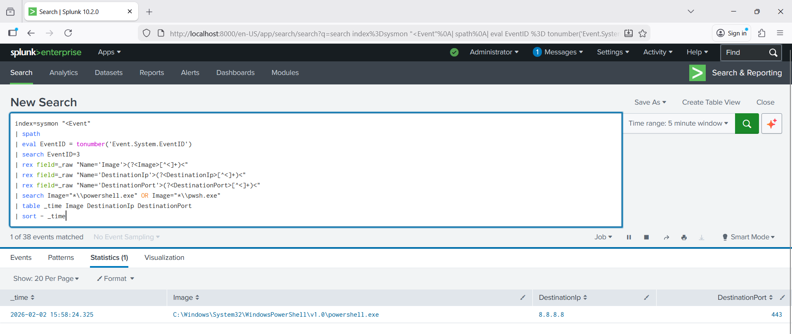

# SOC-Home-Lab

## Lab Overview
This project implements a **Monitoring and Detection SOC Lab** designed to simulate
real-world security operations. The environment is built in phases, starting with
a lightweight endpoint-focused detection setup and expanding into an enterprise
network-based SOC architecture as resources scale.

## Phased Implementation Approach

### Phase 1 – Endpoint Monitoring & Detection (Current)
- Windows endpoint telemetry using Sysmon
- Log collection and analysis via SIEM
- Detection of suspicious authentication and process activity
- Focus on SOC Tier 1 alert analysis and investigation

### Phase 2 – Enterprise SOC Architecture (Planned)
- Network segmentation and firewall monitoring
- Traffic mirroring and network-based detection
- Security Onion deployment
- Multi-source log correlation and alerting

## Architecture Reference
The lab design is inspired by enterprise SOC monitoring architectures involving
firewalls, SIEM platforms, and network-based detection tools. The implementation
prioritizes clarity, scalability, and real-world SOC workflows.

## Endpoint Telemetry
Sysmon was deployed on the Windows endpoint to capture detailed
process creation, network connections, and system activity logs.
These logs serve as the primary data source for detection and analysis
during Phase 1 of the lab.

To enhance visibility, a custom Sysmon configuration was applied
to enable detailed network connection logging (Event ID 3),
aligning endpoint telemetry with SOC detection requirements.

Sysmon WinEventLog input was configured to forward events in XML format (renderXml=true),
enabling consistent parsing and reliable detection queries in Splunk.

## Detection Use Case 01 — PowerShell Network Connections (Sysmon Event ID 3)

### Goal
Detect outbound network connections initiated by PowerShell, a common indicator
in phishing, malware execution, and living-off-the-land techniques.

### Data Source
- Sysmon: Microsoft-Windows-Sysmon/Operational
- Event Type: Network connection (Event ID 3)
- Ingestion: Splunk (XML rendering enabled via `renderXml=true`)

### Test Performed (Safe)
Executed a benign outbound connectivity test from PowerShell:
`Test-NetConnection 8.8.8.8 -Port 443`

### Detection Logic (High Level)
Query Sysmon network connection events and filter where the initiating process
image is `powershell.exe` or `pwsh.exe`.

### Outcome
Verified that Splunk successfully ingests Sysmon telemetry and that the detection
query reliably returns PowerShell-initiated network connections.

### Evidence

**PowerShell Network Query Execution**

**Splunk Detection Results**

**Sysmon Event Log (Event ID 3)**

